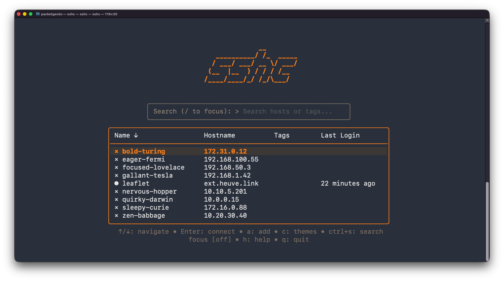

<p align="center">
  <h1 align="center">sshc</h1>
  <p align="center">A modern, interactive terminal UI for managing SSH connections</p>
</p>

<p align="center">
  <a href="https://github.com/xvertile/sshc/releases"></a>
  <a href="https://github.com/xvertile/sshc/blob/main/LICENSE"></a>
  <a href="https://goreportcard.com/report/github.com/xvertile/sshc"></a>
  
</p>

<br>

<p align="center">
  
</p>

<br>

SSHC transforms your `~/.ssh/config` into a searchable, navigable interface — letting you connect to servers, transfer files, and manage hosts without memorizing hostnames or typing lengthy commands.

Built with Go and the [Charm](https://charm.sh) ecosystem for a fast, responsive experience that feels native to the terminal.

---

## Install

```bash
curl -fsSL https://raw.githubusercontent.com/xvertile/sshc/main/install/install.sh | bash
```

**Homebrew**

```bash
brew tap xvertile/sshc && brew install sshc
```

**From source**

```bash
go install github.com/xvertile/sshc@latest
```

<br>

<p align="center">
  
</p>
