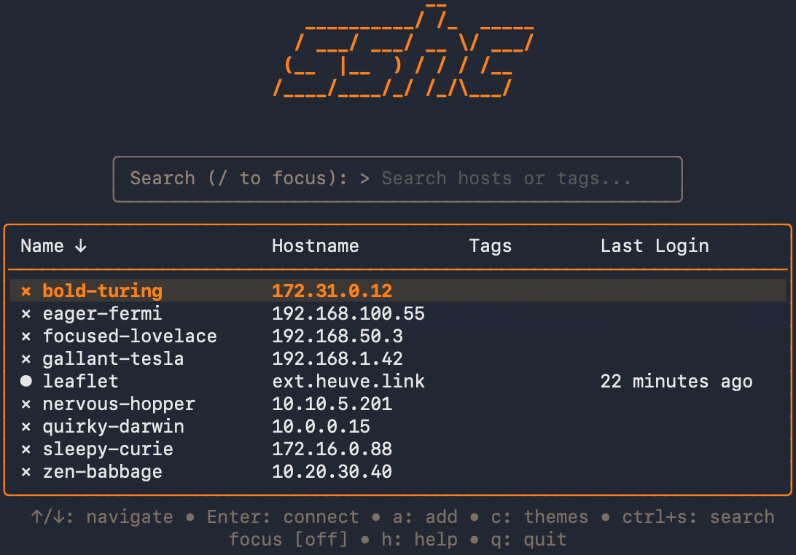

<p align="center">
  <h1 align="center">sshc</h1>
  <p align="center">A modern, interactive terminal UI for managing SSH connections</p>
</p>

<p align="center">
  <a href="https://github.com/xvertile/sshc/releases"></a>
  <a href="https://github.com/xvertile/sshc/blob/main/LICENSE"></a>
  <a href="https://goreportcard.com/report/github.com/xvertile/sshc"></a>
  
</p>

<br>

<p align="center">
  
</p>

<br>

SSHC transforms your `~/.ssh/config` into a searchable, navigable interface — letting you connect to servers, transfer files, and manage hosts without memorizing hostnames or typing lengthy commands.

Built with Go and the [Charm](https://charm.sh) ecosystem for a fast, responsive experience that feels native to the terminal.

---

## Install

```bash
curl -fsSL https://raw.githubusercontent.com/xvertile/sshc/main/install/install.sh | bash
```

**Homebrew**

```bash
brew tap xvertile/sshc && brew install sshc
```

**From source**

```bash
go install github.com/xvertile/sshc@latest
```

<br>

<p align="center">
  <sub>Clean, distraction-free interface with real-time host status</sub>
</p>

<p align="center">
  
</p>

---

## Features

### Host Management

Add, edit, delete, and move SSH hosts through an interactive TUI or CLI.

- Parse `~/.ssh/config` automatically — or specify a custom config with `-c`
- Include directive support with glob patterns and recursive parsing
- Multi-host declarations (`Host server1 server2 server3`)
- Tags for organizing hosts (`#production`, `#database`)
- ProxyJump configuration for bastion/jump host setups
- Custom SSH options per host (RemoteCommand, RequestTTY, etc.)

<p align="center">
  
</p>

### Connection

One-key connect — select a host, press Enter.

- Live status indicators — see which hosts are online before connecting
- Connection history — tracks last login time and connection count
- Sort by recent — quickly access frequently-used hosts
- Retry on failure — connection error view with instant retry option

<p align="center">
  
</p>

### File Transfer

Upload or download files without leaving the TUI.

- Remote file browser — navigate the remote filesystem to select paths
- Local file picker — native picker integration with TUI fallback
- SCP commands — `sshc cp ./file.txt host:/path/` and `sshc get host:/file ./`
- Recursive transfers — full directory upload/download support
- Transfer history — logs all transfers per host

<p align="center">
  
</p>

### SSH Key Management

Upload public keys to remote hosts.

- Select from local keys — browses `~/.ssh/*.pub` automatically
- Paste key directly — paste any public key without a local file
- Auto-config update — optionally add IdentityFile to host config after upload

<p align="center">
  
</p>

### Port Forwarding

Local, remote, and dynamic forwarding with saved configurations.

- Local forwarding (`-L`) — expose remote services locally
- Remote forwarding (`-R`) — expose local services remotely
- Dynamic forwarding (`-D`) — SOCKS proxy
- History — remembers previous port forward configurations per host

<p align="center">
  
</p>

### Kubernetes Support

Manage K8s pods alongside SSH hosts in a unified interface.

- `kubectl exec` integration with namespace, context, and container selection
- Separate config — K8s hosts stored in `~/.config/sshc/k8s.yaml`
- Tags and organization — same tag system as SSH hosts

<p align="center">
  
</p>

### Search & Filter

Real-time search across hosts by name, hostname, or tags.

- Multiple output formats — table, JSON, or simple (one per line)
- CLI search — `sshc search prod --tags` for scripting

<p align="center">
  
</p>

### Customization

Themes, keybindings, and persistent preferences.

- Themes — Default, Nord, Dracula, and more
- Keybindings — customize quit keys, disable ESC for vim users
- Persistent preferences — sort mode, theme, search focus saved to config

<p align="center">
  
</p>

---

## CLI

```
sshc                      Interactive TUI
sshc <host>               Connect directly
sshc add [name]           Add a new host
sshc edit <host>          Edit existing host
sshc search [query]       Search hosts (--format json|table|simple)
sshc cp <src> <dst>       SCP file transfer
sshc send <host>          Upload with file picker
sshc get <host>           Download with remote browser
sshc move <host>          Move host between config files
sshc update               Check for and install updates
```

---

## Cross-Platform

- macOS, Linux, Windows support
- XDG Base Directory compliance on Linux
- Proper permissions — enforces 0600 for config, 0700 for directories
