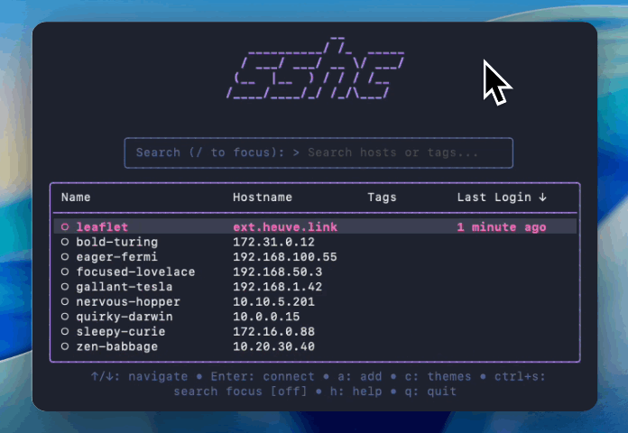

<p align="center">
  <h1 align="center">sshc</h1>
  <p align="center">A modern, interactive terminal UI for managing SSH connections</p>
</p>

<p align="center">
  <a href="https://github.com/xvertile/sshc/releases"></a>
  <a href="https://github.com/xvertile/sshc/blob/main/LICENSE"></a>
  <a href="https://goreportcard.com/report/github.com/xvertile/sshc"></a>
  
</p>

<br>

<p align="center">
  
</p>

<br>

SSHC transforms your `~/.ssh/config` into a searchable, navigable interface — letting you connect to servers, transfer files, and manage hosts without memorizing hostnames or typing lengthy commands.

Built with Go and the [Charm](https://charm.sh) ecosystem. Continuation of [sshm](https://github.com/Gu1llaum-3/sshm).

---

## Install

```bash
curl -fsSL https://raw.githubusercontent.com/xvertile/sshc/main/install/install.sh | bash
```

**Homebrew**

```bash
brew tap xvertile/sshc && brew install sshc
```

**From source**

```bash
go install github.com/xvertile/sshc@latest
```

<br>

<p align="center">
  <sub>Clean, distraction-free interface with real-time host status</sub>
</p>

<p align="center">
  
</p>

---

## Features

### Host Management

Add, edit, delete, and move SSH hosts through an interactive TUI or CLI.

- Parse `~/.ssh/config` automatically — or specify a custom config with `-c`
- Include directive support with glob patterns and recursive parsing
- Multi-host declarations (`Host server1 server2 server3`)
- Tags for organizing hosts (`#production`, `#database`)
- ProxyJump configuration for bastion/jump host setups
- Custom SSH options per host (RemoteCommand, RequestTTY, etc.)

<p align="center">
  
</p>

### Connection

One-key connect — select a host, press Enter.

- Live status indicators — see which hosts are online before connecting
- Connection history — tracks last login time and connection count
- Sort by recent — quickly access frequently-used hosts
- Retry on failure — connection error view with instant retry option

<p align="center">
  
</p>

### File Transfer

Upload or download files without leaving the TUI.

- Remote file browser — navigate the remote filesystem to select paths
- Local file picker — native picker integration with TUI fallback
- SCP commands — `sshc cp ./file.txt host:/path/` and `sshc get host:/file ./`
- Recursive transfers — full directory upload/download support
- Transfer history — logs all transfers per host

<p align="center">
  
</p>

### SSH Key Management

Upload public keys to remote hosts.

- Select from local keys — browses `~/.ssh/*.pub` automatically
- Paste key directly — paste any public key without a local file
- Auto-config update — optionally add IdentityFile to host config after upload

<p align="center">
  
</p>

### Port Forwarding

Local, remote, and dynamic forwarding with saved configurations.

- Local forwarding (`-L`) — expose remote services locally
- Remote forwarding (`-R`) — expose local services remotely
- Dynamic forwarding (`-D`) — SOCKS proxy
- History — remembers previous port forward configurations per host

<p align="center">
  
</p>

### Search & Filter

Real-time search across hosts by name, hostname, or tags.

- Multiple output formats — table, JSON, or simple (one per line)
- CLI search — `sshc search prod --tags` for scripting

<p align="center">
  
</p>


### Kubernetes Support

Manage K8s pods alongside SSH hosts in a unified interface.

- `kubectl exec` integration with namespace, context, and container selection
- Separate config — K8s hosts stored in `~/.config/sshc/k8s.yaml`
- Tags and organization — same tag system as SSH hosts


### Customization

Themes, keybindings, and persistent preferences.

- Themes — Default, Nord, Dracula, and more
- Keybindings — customize quit keys, disable ESC for vim users
- Persistent preferences — sort mode, theme, search focus saved to config

<p align="center">
  
</p>

---

## CLI

```
sshc                      Interactive TUI
sshc <host>               Connect directly
sshc add [name]           Add a new host
sshc edit <host>          Edit existing host
sshc search [query]       Search hosts (--format json|table|simple)
sshc cp <src> <dst>       SCP file transfer
sshc send <host>          Upload with file picker
sshc get <host>           Download with remote browser
sshc move <host>          Move host between config files
sshc update               Check for and install updates
```

---

## Usage

### Interactive Mode

Launch without arguments to enter the TUI:

```bash
sshc
```

### Navigation

```
up/down, j/k      Navigate hosts
enter             Connect to selected host
a                 Add new host
e                 Edit selected host
d                 Delete selected host
m                 Move host to another config file
f                 Port forwarding setup
t                 File transfer
/                 Search/filter hosts
s                 Switch sort mode (name/recent)
n                 Sort by name
r                 Sort by recent
tab               Cycle filter modes
q                 Quit
```

### Status Indicators

- Green — host is reachable via SSH
- Yellow — currently checking connectivity
- Red — host is unreachable or connection failed
- Gray — status not yet determined

### Direct Connection

Connect to any configured host without entering the TUI:

```bash
sshc production-server
sshc db-staging
sshc web-01
```

All direct connections are tracked in history. Use `-c` for custom config files:

```bash
sshc my-server -c /path/to/custom/ssh_config
```

---

## Port Forwarding

Press `f` while a host is selected to open the port forwarding interface.

### Forward Types

**Local (-L)** — forward a local port to a remote host through the SSH connection

```
ssh -L 15432:localhost:5432 server
# Database on remote localhost:5432 becomes accessible at localhost:15432
```

**Remote (-R)** — forward a remote port back to a local service

```
ssh -R 8080:localhost:3000 server
# Local app on port 3000 becomes accessible from remote host's port 8080
```

Requirements for external access:
- SSH server config: `GatewayPorts yes` in `/etc/ssh/sshd_config`
- Firewall: open the remote port
- Bind address: use `0.0.0.0` for external, `127.0.0.1` for local-only

**Dynamic (-D)** — create a SOCKS proxy

```
ssh -D 1080 server
# Configure browser to use localhost:1080 as SOCKS5 proxy
```

### Port Forwarding History

SSHC remembers forwarding configurations per host. Previously used setups appear as suggestions for quick reuse.

---

## Configuration

SSHC works directly with your `~/.ssh/config` file. Custom configs can be specified with `-c`:

```bash
sshc -c /path/to/config
```

### SSH Include Support

Organize configurations across multiple files:

```ssh
# ~/.ssh/config
Include ~/.ssh/conf.d/*
Include work-servers.conf

Host personal
    HostName personal.example.com
    User me
```

The `move` command relocates hosts between included config files.

### Supported SSH Options

Built-in fields:
- `HostName` — server address
- `User` — SSH username
- `Port` — SSH port
- `IdentityFile` — path to private key
- `ProxyJump` — jump host for tunneling
- `Tags` — custom tags (SSHC extension)

Any valid SSH option can be added through the forms. Enter in command-line format:

```
-o Compression=yes -o ServerAliveInterval=60
```

This converts to:

```ssh
    Compression yes
    ServerAliveInterval 60
```

Common options: `Compression`, `ServerAliveInterval`, `ServerAliveCountMax`, `StrictHostKeyChecking`, `UserKnownHostsFile`, `BatchMode`, `ConnectTimeout`, `ControlMaster`, `ControlPath`, `ControlPersist`, `ForwardAgent`, `LocalForward`, `RemoteForward`, `DynamicForward`.

### Custom Key Bindings

Configure in `~/.config/sshc/config.json`:

```json
{
  "key_bindings": {
    "quit_keys": ["q", "ctrl+c"],
    "disable_esc_quit": true
  }
}
```

Set `disable_esc_quit` to `true` if you use vim and accidentally quit with ESC.

### Data Storage

```
~/.config/sshc/
├── config.json          # preferences, keybindings
├── history.json         # connection history
├── k8s.yaml             # kubernetes hosts
└── backups/             # automatic config backups
```

Backups are created automatically before any configuration change.

---

## Platform Notes

**macOS / Linux**
- Standard config: `~/.ssh/config`
- XDG Base Directory compliance on Linux
- File permissions enforced (0600 config, 0700 directories)

**Windows**
- Works with built-in OpenSSH client (Windows 10/11)
- Config location: `%USERPROFILE%\.ssh\config`
- Compatible with WSL configurations

---

## Building from Source

```bash
git clone https://github.com/xvertile/sshc.git
cd sshc
go build -o sshc .
sudo mv sshc /usr/local/bin/
```

### Dependencies

- [Cobra](https://github.com/spf13/cobra) — CLI framework
- [Bubble Tea](https://github.com/charmbracelet/bubbletea) — TUI framework
- [Bubbles](https://github.com/charmbracelet/bubbles) — TUI components
- [Lip Gloss](https://github.com/charmbracelet/lipgloss) — styling
- [x/crypto/ssh](https://golang.org/x/crypto/ssh) — SSH connectivity

---

## Releases

| Platform | Architecture | Download |
|----------|--------------|----------|
| Linux | AMD64 | [sshc-linux-amd64.tar.gz](https://github.com/xvertile/sshc/releases/latest/download/sshc-linux-amd64.tar.gz) |
| Linux | ARM64 | [sshc-linux-arm64.tar.gz](https://github.com/xvertile/sshc/releases/latest/download/sshc-linux-arm64.tar.gz) |
| macOS | Intel | [sshc-darwin-amd64.tar.gz](https://github.com/xvertile/sshc/releases/latest/download/sshc-darwin-amd64.tar.gz) |
| macOS | Apple Silicon | [sshc-darwin-arm64.tar.gz](https://github.com/xvertile/sshc/releases/latest/download/sshc-darwin-arm64.tar.gz) |
| Windows | AMD64 | [sshc-windows-amd64.zip](https://github.com/xvertile/sshc/releases/latest/download/sshc-windows-amd64.zip) |
| Windows | ARM64 | [sshc-windows-arm64.zip](https://github.com/xvertile/sshc/releases/latest/download/sshc-windows-arm64.zip) |

---

## Contributing

1. Fork the repository
2. Create a feature branch (`git checkout -b feature/new-feature`)
3. Commit changes (`git commit -m 'Add new feature'`)
4. Push to branch (`git push origin feature/new-feature`)
5. Open a Pull Request

---

## License

MIT — see [LICENSE](LICENSE) for details.

---

## Acknowledgments

- [Charm](https://charm.sh/) for the TUI libraries
- [Guillaume](https://github.com/Gu1llaum-3) for the original [sshm](https://github.com/Gu1llaum-3/sshm)
- [yimeng](https://github.com/yimeng) for SSH Include directive support
- [ldreux](https://github.com/ldreux) for multi-word search
- [qingfengzxr](https://github.com/qingfengzxr) for custom key bindings
